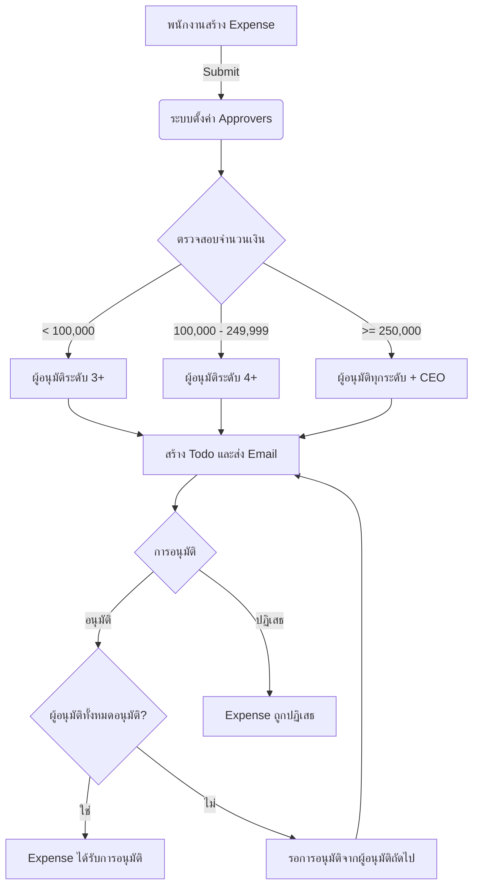

1. DocType: Workflow Approver
```python
{
 "name": "Workflow Approver",
 "doctype": "DocType",
 "istable": 1,
 "fields": [
  {
   "fieldname": "approver",
   "fieldtype": "Link",
   "label": "Approver",
   "options": "User",
   "reqd": 1
  },
  {
   "fieldname": "status",
   "fieldtype": "Select",
   "label": "Status",
   "options": "Pending\nApproved\nRejected",
   "default": "Pending"
  },
  {
   "fieldname": "approver_level",
   "fieldtype": "Int",
   "label": "Approver Level"
  },
  {
   "fieldname": "approver_role",
   "fieldtype": "Link",
   "label": "Approver Role",
   "options": "Role"
  },
  {
   "fieldname": "comments",
   "fieldtype": "Small Text",
   "label": "Comments"
  }
 ]
}
```

2. Custom Fields สำหรับ User DocType:
```python
{
 "custom_fields": [
  {
   "fieldname": "employee_grade",
   "fieldtype": "Int",
   "label": "Employee Grade"
  },
  {
   "fieldname": "reports_to",
   "fieldtype": "Link",
   "label": "Reports To",
   "options": "User"
  }
 ]
}
```

3. ปรับปรุง Expense DocType (ตัวอย่าง):
```python
{
 "name": "Expense",
 "doctype": "DocType",
 "fields": [
  // ... ฟิลด์อื่นๆ ...
  {
   "fieldname": "approvers",
   "fieldtype": "Table",
   "label": "Approvers",
   "options": "Workflow Approver"
  },
  {
   "fieldname": "workflow_state",
   "fieldtype": "Link",
   "label": "Workflow State",
   "options": "Workflow State",
   "read_only": 1
  },
  {
   "fieldname": "workflow_description",
   "fieldtype": "Data",
   "label": "Workflow Description",
   "read_only": 1
  }
 ]
}
```

4. ฟังก์ชันในไฟล์ Python ของ Expense:
```python
import frappe

def set_approvers(doc):
    doc.approvers = []
    amount = doc.amount
    
    approvers = get_approvers(doc.owner, amount)
    for level, approver in enumerate(approvers, start=1):
        doc.append("approvers", {
            "approver": approver,
            "status": "Pending",
            "approver_level": level
        })
    
    update_workflow_state(doc)

def get_approvers(employee, amount):
    approvers = []
    current_user = frappe.get_doc("User", employee)
    
    while current_user.reports_to:
        approver = frappe.get_doc("User", current_user.reports_to)
        approvers.append(approver.name)
        
        approval_limit = frappe.get_value("Approval Limit", 
                                          {"employee_grade": approver.employee_grade}, 
                                          "approval_limit")
        
        if approval_limit and amount <= approval_limit:
            break
        
        current_user = approver
    
    if not approvers or amount > approval_limit:
        ceo = frappe.get_all("User", filters={"employee_grade": 5}, limit=1)
        if ceo:
            approvers.append(ceo[0].name)
    
    return approvers

def update_workflow_state(doc):
    pending_approvers = [a.approver for a in doc.approvers if a.status == "Pending"]
    if pending_approvers:
        doc.workflow_state = "Pending Approval"
        doc.workflow_description = f"รออนุมัติจาก {', '.join(pending_approvers)}"
    elif all(a.status == "Approved" for a in doc.approvers):
        doc.workflow_state = "Approved"
        doc.workflow_description = "อนุมัติแล้ว"
    else:
        doc.workflow_state = "Rejected"
        doc.workflow_description = "ถูกปฏิเสธ"

def create_todo_and_send_email(doc):
    for approver in doc.approvers:
        if approver.status == "Pending":
            create_todo(doc, approver.approver)
            send_email_notification(doc, approver.approver)

def create_todo(doc, approver):
    frappe.get_doc({
        "doctype": "ToDo",
        "owner": approver,
        "reference_type": doc.doctype,
        "reference_name": doc.name,
        "description": f"อนุมัติ {doc.doctype} {doc.name}",
        "status": "Open"
    }).insert(ignore_permissions=True)

def send_email_notification(doc, approver):
    subject = f"ขออนุมัติ {doc.doctype} {doc.name}"
    message = f"กรุณาอนุมัติ {doc.doctype} {doc.name}\n\nรายละเอียด: {doc.description}\nจำนวนเงิน: {doc.amount}"
    frappe.sendmail(
        recipients=[approver],
        subject=subject,
        message=message
    )

def on_update(doc, method):
    if doc.workflow_state == "Pending Approval":
        current_user = frappe.session.user
        for approver in doc.approvers:
            if approver.approver == current_user and approver.status == "Pending":
                approver.status = "Approved"
                frappe.db.set_value("Workflow Approver", approver.name, "status", "Approved")
                break
        
        update_workflow_state(doc)
        
        if doc.workflow_state == "Pending Approval":
            create_todo_and_send_email(doc)
        
        doc.save(ignore_permissions=True)

def on_submit(doc, method):
    set_approvers(doc)
    create_todo_and_send_email(doc)
```

5. Workflow:
```python
{
 "workflow_name": "Expense Approval Workflow",
 "document_type": "Expense",
 "states": [
  {
   "state": "Draft",
   "doc_status": 0,
   "allow_edit": "Employee"
  },
  {
   "state": "Pending Approval",
   "doc_status": 0,
   "allow_edit": "System Manager"
  },
  {
   "state": "Approved",
   "doc_status": 1,
   "allow_edit": "System Manager"
  },
  {
   "state": "Rejected",
   "doc_status": 2,
   "allow_edit": "System Manager"
  }
 ],
 "transitions": [
  {
   "state": "Draft",
   "action": "Submit",
   "next_state": "Pending Approval",
   "allowed": "Employee"
  },
  {
   "state": "Pending Approval",
   "action": "Approve",
   "next_state": "Pending Approval",
   "allowed": "Employee",
   "condition": "frappe.session.user in [a.approver for a in doc.approvers if a.status == 'Pending']"
  },
  {
   "state": "Pending Approval",
   "action": "Approve",
   "next_state": "Approved",
   "allowed": "Employee",
   "condition": "all(a.status == 'Approved' for a in doc.approvers)"
  },
  {
   "state": "Pending Approval",
   "action": "Reject",
   "next_state": "Rejected",
   "allowed": "Employee",
   "condition": "frappe.session.user in [a.approver for a in doc.approvers if a.status == 'Pending']"
  }
 ]
}
```

6. Flow Diagram ของกระบวนการอนุมัติ:



7. คำอธิบาย Flow:

1. พนักงานสร้าง Expense และกด Submit
2. ระบบจะตั้งค่า Approvers ตามลำดับขั้นการบังคับบัญชาและจำนวนเงิน
3. ระบบตรวจสอบจำนวนเงินและกำหนดระดับผู้อนุมัติที่เหมาะสม:
   - น้อยกว่า 100,000: ผู้อนุมัติระดับ 3 ขึ้นไป
   - 100,000 - 249,999: ผู้อนุมัติระดับ 4 ขึ้นไป
   - 250,000 ขึ้นไป: ผู้อนุมัติทุกระดับรวมถึง CEO
4. ระบบสร้าง Todo และส่ง Email แจ้งเตือนผู้อนุมัติ
5. ผู้อนุมัติดำเนินการอนุมัติหรือปฏิเสธ:
   - หากอนุมัติ: ระบบตรวจสอบว่าผู้อนุมัติทั้งหมดได้อนุมัติหรือไม่
     - ถ้าใช่: Expense ได้รับการอนุมัติ
     - ถ้าไม่: รอการอนุมัติจากผู้อนุมัติถัดไป
   - หากปฏิเสธ: Expense ถูกปฏิเสธทันที

Flow diagram นี้แสดงให้เห็นภาพรวมของกระบวนการอนุมัติ Expense ตั้งแต่การสร้างเอกสารจนถึงการอนุมัติขั้นสุดท้าย ช่วยให้เข้าใจลำดับขั้นตอนและเงื่อนไขต่างๆ ได้ง่ายขึ้นครับ

8. DocType: Approval Limit
```python
{
 "name": "Approval Limit",
 "doctype": "DocType",
 "fields": [
  {
   "fieldname": "employee_grade",
   "fieldtype": "Int",
   "label": "ระดับพนักงาน",
   "reqd": 1
  },
  {
   "fieldname": "approval_limit",
   "fieldtype": "Currency",
   "label": "วงเงินอนุมัติสูงสุด",
   "reqd": 1
  },
  {
   "fieldname": "description",
   "fieldtype": "Small Text",
   "label": "คำอธิบาย"
  }
 ]
}
```

9. ปรับปรุงฟังก์ชัน get_approvers ในไฟล์ Python ของ Expense:
```python
def get_approvers(employee, amount):
    approvers = []
    current_user = frappe.get_doc("User", employee)
    
    while current_user.reports_to:
        approver = frappe.get_doc("User", current_user.reports_to)
        approvers.append(approver.name)
        
        approval_limit = frappe.get_value("Approval Limit", 
                                          {"employee_grade": approver.employee_grade}, 
                                          "approval_limit")
        
        if approval_limit and amount <= approval_limit:
            break
        
        current_user = approver
    
    if not approvers or amount > approval_limit:
        ceo = frappe.get_all("User", filters={"employee_grade": 5}, limit=1)
        if ceo:
            approvers.append(ceo[0].name)
    
    return approvers
```

10. คำอธิบายการเปลี่ยนแปลง:

- สร้าง DocType ใหม่ชื่อ "Approval Limit" เพื่อเก็บข้อมูลวงเงินอนุมัติสำหรับแต่ละระดับพนักงาน
- ปรับปรุงฟังก์ชัน `get_approvers` ให้ใช้ข้อมูลจาก DocType "Approval Limit"
- ระบบจะตรวจสอบวงเงินอนุมัติของผู้อนุมัติแต่ละคนตามระดับพนักงาน
- ถ้าจำนวนเงินที่ขออนุมัติไม่เกินวงเงินของผู้อนุมัติคนใด จะหยุดการเพิ่มผู้อนุมัติ
- ถ้าจำนวนเงินเกินวงเงินของทุกคนในสายบังคับบัญชา หรือไม่มีผู้อนุมัติเลย จะเพิ่ม CEO (ระดับ 5) เป็นผู้อนุมัติสุดท้าย

11. การนำไปใช้:

1. สร้าง DocType "Approval Limit" ตามที่กำหนดไว้
2. เพิ่มข้อมูลวงเงินอนุมัติสำหรับแต่ละระดับใน DocType "Approval Limit"
3. ปรับปรุงฟังก์ชัน `get_approvers` ในไฟล์ Python ของ Expense
4. ทดสอบระบบโดยสร้าง Expense ที่มีจำนวนเงินต่างๆ เพื่อตรวจสอบว่าระบบเลือกผู้อนุมัติได้ถูกต้องตามวงเงินที่กำหนด

ด้วยการเปลี่ยนแปลงนี้ ระบบจะมีความยืดหยุ่นในการกำหนดวงเงินอนุมัติสำหรับแต่ละระดับพนักงาน และสามารถปรับเปลี่ยนได้ง่ายผ่านการแก้ไขข้อมูลใน DocType "Approval Limit"

การนำไปใช้:
1. สร้าง DocType "Workflow Approver"
2. เพิ่ม Custom Fields ใน User DocType
3. ปรับปรุงเอกสารที่ต้องการใช้ระบบอนุมัติ (เช่น Expense)
4. เพิ่มฟังก์ชันทั้งหมดในไฟล์ Python ของเอกสาร
5. สร้าง Workflow

solution นี้จะให้ระบบการอนุมัติที่ยืดหยุ่น ใช้งานง่าย และมีการแจ้งเตือนผ่าน Todo และ Email ครับ